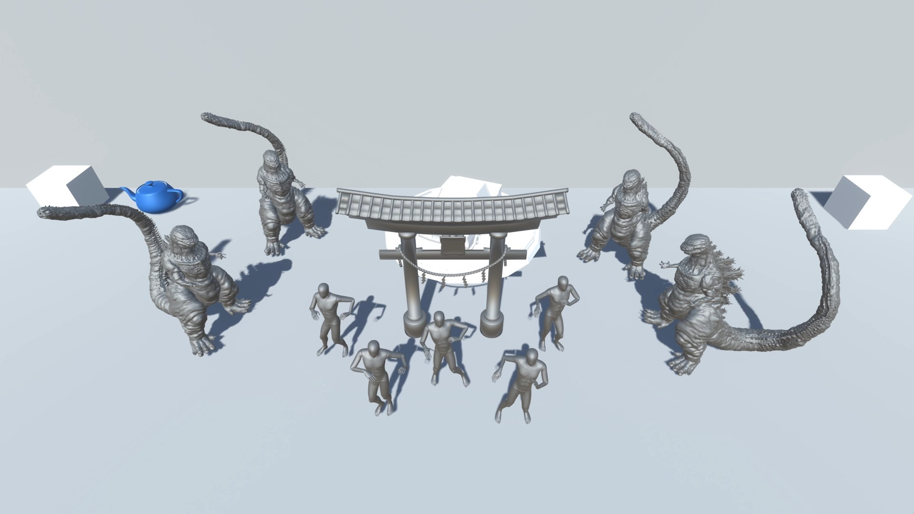

# 3D_Printing_Effect

Left click: Hold to pick position, Release to place the model

Keyboard Key "T": Switch models

Keyboard Key "E", "Q": Rotate model

Keyboard Key "Escape": Cancel placement

NOTE: The code is still super messy and needs lots of refactoring

